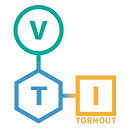
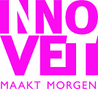
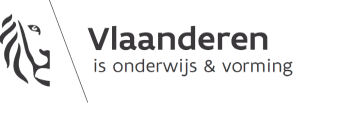

# Samenwerken voor het ontwikkelen van cursusmateriaal met Git - GitHub - Vuepress 

## Studiedag 13/12/2019

Het ontwikkelen van cursusmateriaal en oefeningen vergt veel tijd. Samenwerken door materiaal te delen via **open source** kan hierbij helpen.  

In deze studiedag vertrekken wij vanuit een versiebeheertool genaamd **git**. Deze tool wordt voornamelijk gebruikt bij softwareprojecten voor het beheren van alle bronbestanden. 

Deze studiedag is interessant voor alle leerkrachten secundair onderwijs met interesse in software, IoT en het samenwerken voor het ontwikkelen van nieuw cursumateriaal. Voor deze studiedag is geen voorkennis vereist. Een gezonde interesse in IT is wel noodzakelijk. 

Neem je eigen laptop mee om zelf aan de slag te gaan met de tools. Installatierechten op deze laptop zijn vereist.  

### Git

[Git](https://git-scm.com) is een populaire versiebeheertool. Het gebruik van een versiebeheertool is onontbeerlijk om het overzicht te bewaren, fouten te voorkomen en samen te werken in een project.

### GitHub

[GitHub](https://github.com) is een verzamelplaats van git-gebaseerde projecten. Deze gratis clouddienst maakt het eenvoudig om code te delen en samen te werken. Daarnaast is er ook de mogelijkheid om gebruikt te maken van *GitHub Classroom*, diensten specifiek gericht op het gebruik van **git** in het onderwijs. 

### Vuepress

[Vuepress](https://vuepress.vuejs.org) is een statische website generator. Met deze software kan men een statische website laten genereren vanuit bronbestanden die in een **GitHub repository** worden gehost. Met [Netlify](https://www.netlify.com/) kan men deze statische website automatisch beschikbaar stellen.

## Locatie

VIVES campus Brugge station
Spoorwegstraat 12 
8200 Brugge

## Programma

* 08u30 Ontvangst
* 09u00 IoT, slimme school 2.0 project
* 09u20 Git deel 1
* 10u30 Break
* 10u45 GitHub 
* 12u15 Break
* 13u15 Git deel 2
* 14u45 Break
* 15u00 Vuepress, copyright
* 16u30 Einde

## Innovet: IoT, slimme school 2.0

Deze studiedag wordt aangeboden in het kader van het Innovet project: *IoT, slimme school 2.0*. Dit project is een samenwerking tussen VTI Torhout en de VIVES hogeschool. 

